# Phase 1: Prepare Windows 11 Host for Hyper-V
_Note: This file replaces the original VirtualBox setup. See `00a-migration-rationale.md` for migration details._

## Step 1: Turn on Hyper-V and Required Features

To run the Ubuntu Admin VM using Hyper-V, we first enable the Hyper-V feature on the Windows 11 host.

### 1.1: Open "Windows Features"

- Press `Windows + S` and search for “Windows Features”.
- Click **“Turn Windows features on or off”**.
- Check the following boxes:
  - **Hyper-V**
  - **Virtual Machine Platform**
  - **Windows Hypervisor Platform**
 


---

### 1.2: Reboot After Enabling Features

Once selected, click **OK**. Windows will apply the changes and ask you to reboot.


After rebooting, Hyper-V will be available via the Start Menu → "Hyper-V Manager".

---

# Phase 2: Set Up the Ubuntu Admin VM

## Step 1: Open Hyper-V Manager

- Press `Windows + S` and search for "Hyper-V Manager".
- Open the application and verify it launches successfully.
- Confirm your PC name appears on the left panel under Hyper-V Manager.


---

## Step 2 (Before VM Creation): Create an External Virtual Switch

To give the Ubuntu Admin VM full internet access and LAN communication, we have to create an **External Virtual Switch** in Hyper-V.

### 2.1: Open the Virtual Switch Manager

- In **Hyper-V Manager**, select your computer name (left panel)
- Click **“Virtual Switch Manager…”** from the right panel
- Select **External** and click **Create Virtual Switch**
 


---

### 2.2: Configure the Switch

- Name it: `External Switch (Internet Access)`
- For **Connection type**, choose the real adapter that gives your host internet access.  
  
  - In my case: `Qualcomm FastConnect 7800 Wi-Fi 7 High Band Simultaneous (HBS) Network Adapter`

- Do **not** select:
  - VirtualBox adapters
  - Numbered duplicates (#2, #3, etc.)
- Leave **Allow management OS to share this network adapter** checked (recommended)

Click **OK** to apply and close the window.


----

## Step 3: Create the Ubuntu Admin VM

Now that Hyper-V is enabled and the external switch is configured, we'll create the Ubuntu Admin VM using the Hyper-V Manager interface.

---

### 3.1: Download Ubuntu Desktop ISO

Download the latest **LTS Ubuntu Desktop** ISO from the official Ubuntu website:

- Download the latest [Ubuntu Desktop LTS ISO](https://ubuntu.com/download/desktop) from the official website. 
- Version used in this lab: Ubuntu 24.04.2 LTS
- File: `ubuntu-24.04.2-desktop-amd64.iso`
- Size: ~5.9GB
- Save it somewhere easy to access, like a **Custom** folder.

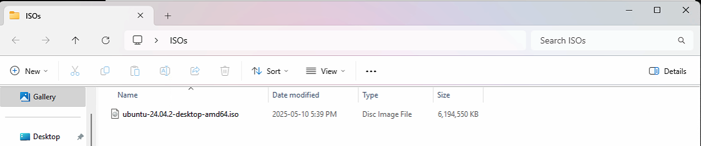

**Note**: This ISO is large (~5GB) and includes GNOME and all major desktop components. You may choose the Minimal ISO instead if you prefer a lighter base and are comfortable installing required packages manually.

---

### 3.2: Create a New VM

- In **Hyper-V Manager**, click **New > Virtual Machine** (in the right panel)
- Click **Next** through the *Before You Begin* screen

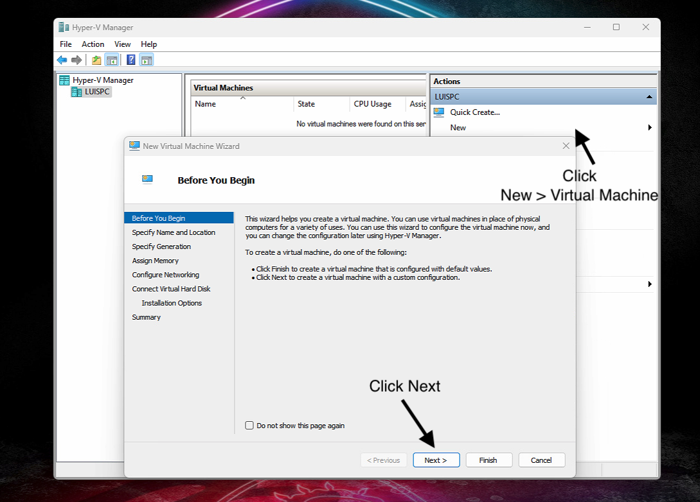

---

### 3.3: Specify Name and Location

- **Name**: `ubuntu-admin-vm`
- You may optionally check **Store the virtual machine in a different location** if you want to save the VM files to a specific drive (e.g. SSD for faster performance or external disk for portability).

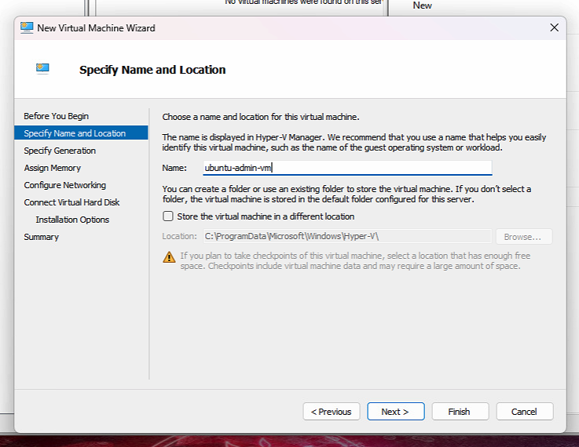

---

### 3.4: Specify Generation

- Choose: **Generation 2**
- This enables UEFI and better compatibility with newer OSes like Ubuntu.

> ⚠️ Once the VM is created, its generation **cannot be changed**. If you accidentally choose Generation 1, you must delete and recreate the VM.

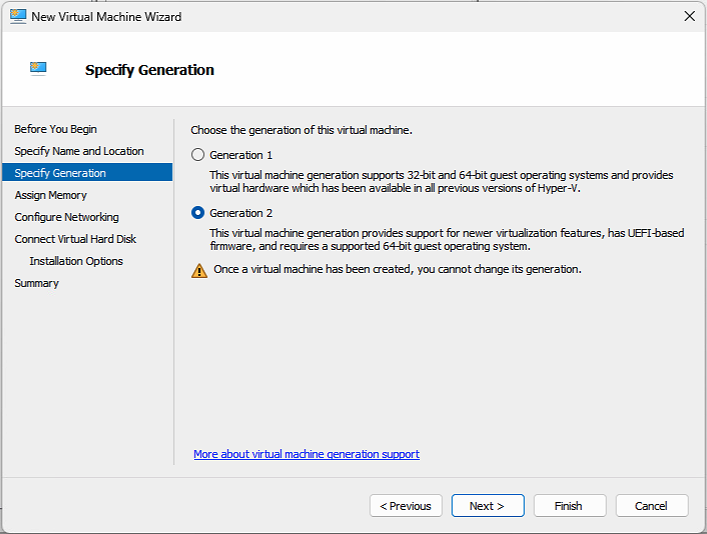

---

### 3.5: Assign Memory

- Startup memory: **8192 MB** (8 GB)
- You may increase this to **12288 MB (12 GB)** or **16384 MB (16 GB)** if your system has sufficient RAM.
- Uncheck **Use Dynamic Memory for this virtual machine** for more stable performance in nested environments.

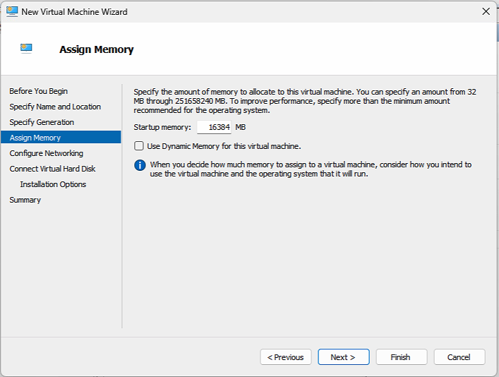

---

### 3.6: Configure Networking

- Connect the VM to the **External Virtual Switch** you created earlier (`External Switch (Internet Access)`).

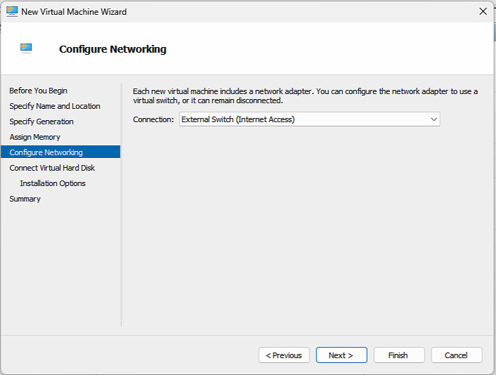

---

### 3.7: Create Virtual Hard Disk

- Select **Create a virtual hard disk** (default)
- Name: `ubuntu-admin-vm.vhdx`
- Size: `80 GB` or more (recommended minimum: 60 GB)
- Leave location as default or choose a custom folder

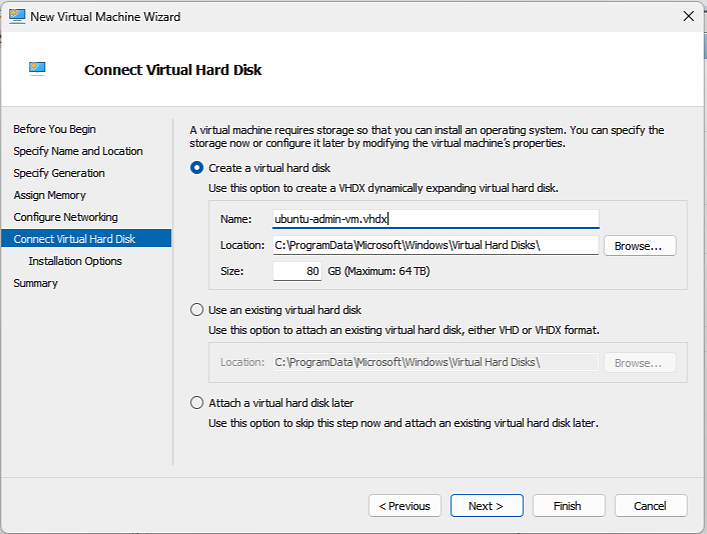

---

### 3.8: Select Installation Media

- Choose **Install an operating system from a bootable CD/DVD ROM**
- Select **Image file (.iso)**
- Browse and select the Ubuntu Desktop ISO you downloaded

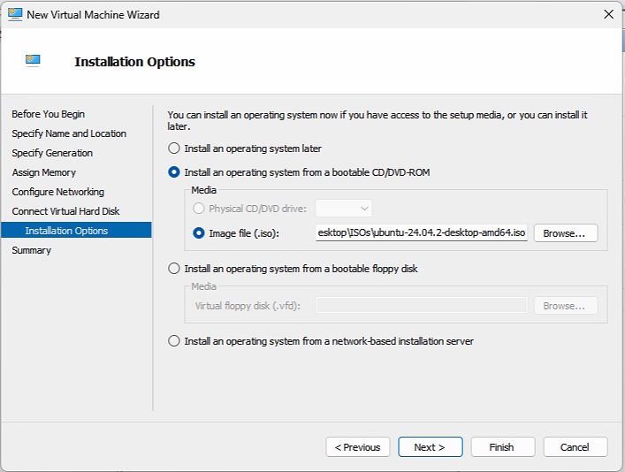

---

### 3.9: Finish Setup

- Review the summary and click **Finish**
- The VM will be created and ready to power on

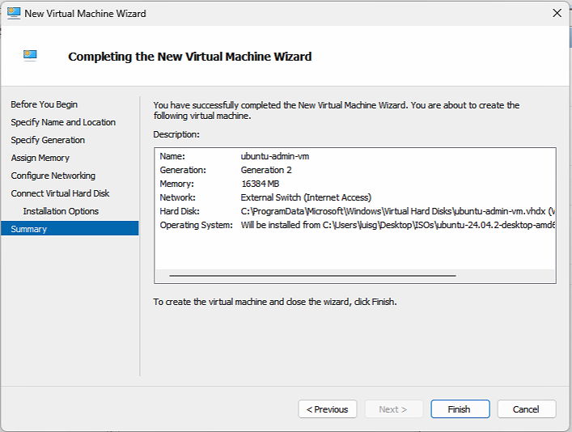

> ✅ The Ubuntu Admin VM has now been successfully created in Hyper-V.  
> In the next step, we’ll power it on and complete the Ubuntu Desktop installation.

---

## Step 4: Install Ubuntu Desktop in the Admin VM

Now that the `ubuntu-admin-vm` is created, it's time to boot it and begin installing Ubuntu.

### 4.1: Start the VM

- In **Hyper-V Manager**, right-click `ubuntu-admin-vm` and choose **Connect**
- Then, click the green **Start** button at the top.

If the ISO was properly attached and secure boot is disabled, you should see the Ubuntu boot menu or loading screen shortly.

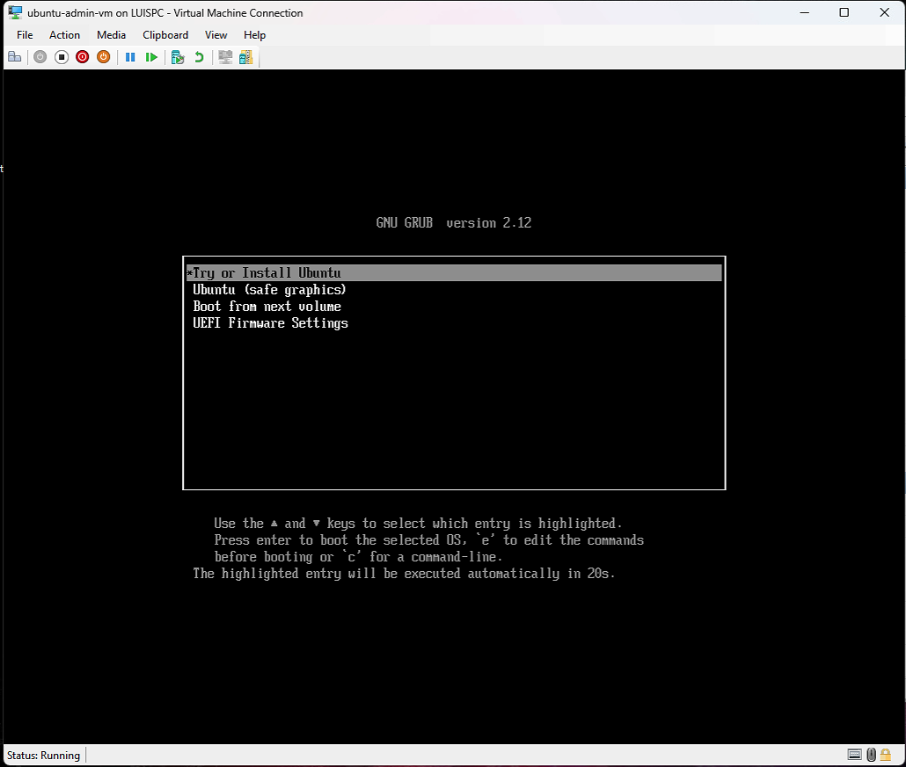

---

### ⚠️ Troubleshooting: Secure Boot Error

If you see this on your screen instead of the Ubuntu installer:

> **Virtual Machine Boot Summary**  
> **1. SCSI DVD:** The signed image’s hash is not allowed (DB)

This means **Secure Boot is blocking the Ubuntu ISO**. To fix:

#### Disable Secure Boot:
1. Shut down the VM (red power button → **Shut Down**)
2. In **Hyper-V Manager**, right-click `ubuntu-admin-vm` → **Settings**
3. Go to **Security** from the sidebar
4. Uncheck **Enable Secure Boot**
5. Click **OK** to apply

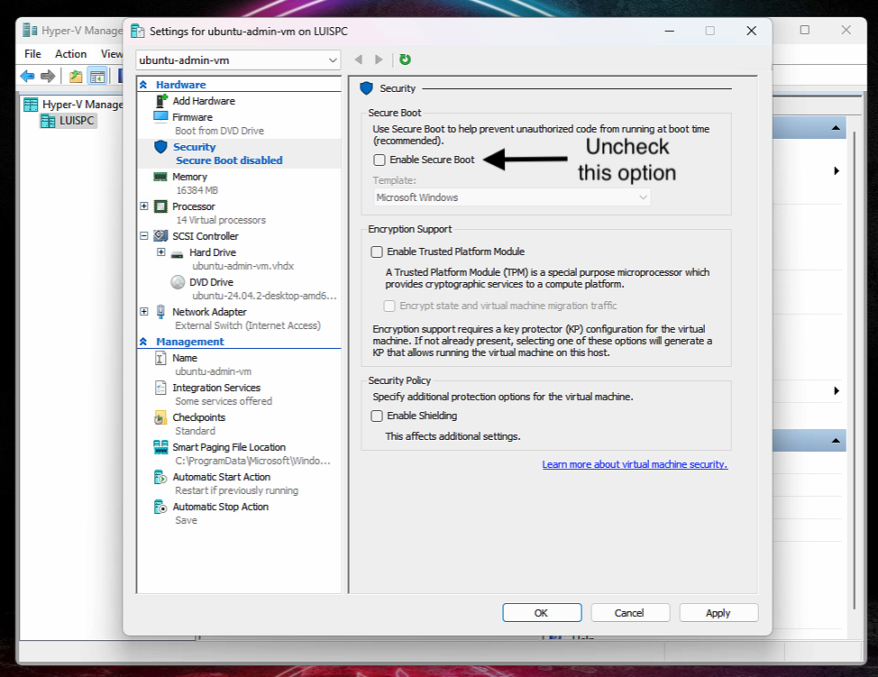

Then, restart the VM. The Ubuntu installer should now load properly

---

### 4.2: Go Through the Installer

Once the Ubuntu installer loads:

1. Select your preferred language (e.g., **English**) → **Continue**
2. On the Accessibility screen, click **Continue** (no changes needed for this lab)
3. On the Keyboard screen:
   - Layout: **English (US)**
   - Click **Continue**
4. On the Network screen:
   - Select **Use wired connection** (or your detected interface)
   - This ensures the installer has access to the internet during setup
   - Click **Continue**

---

### 4.3: Skip Installer Update Prompt

You may see the following screen:

> **An update is available for the installer**  
> Update to the latest version for improved reliability and more features.

- Click **Skip**

> *Why?*  
> To avoid version mismatches and maintain predictable setup results, we use the ISO’s original installer and apply updates later using the script `update-system.sh`.
  
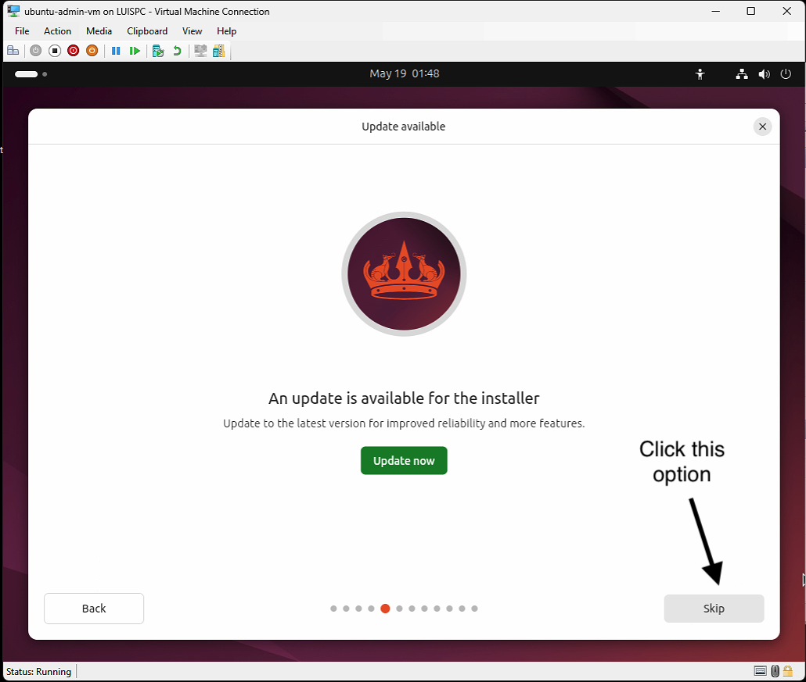

---

### 4.4: Installation Type

On the "Try or Install Ubuntu" screen:

- Select: **Install Ubuntu**
- Click **Next**

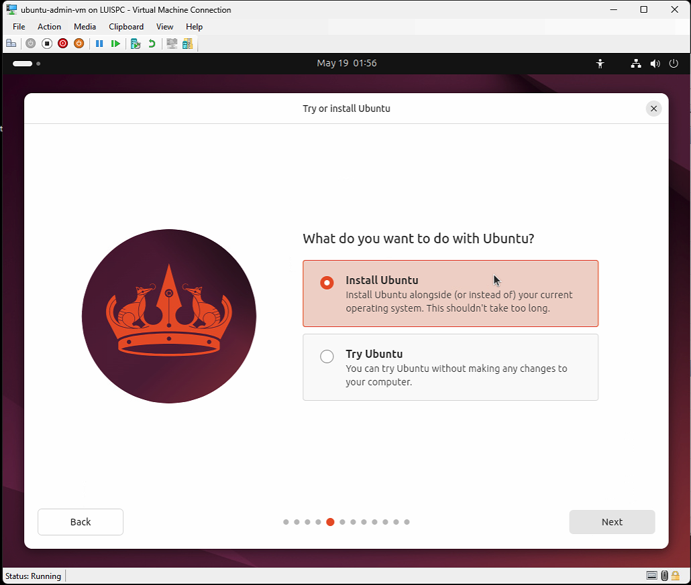

---

### 4.5: Installation Mode

On the "Type of Installation" screen:

- Choose **Interactive installation**
- Click **Next**

_We do not use automated installation, as it requires a custom `autoinstall.yaml` configuration file, which is not needed for this lab._

---

### 4.6: Application Selection

On the "Applications" screen:

- Choose **Default selection**
  - This includes just the essentials: web browser and basic utilities.
  - Ideal for our lightweight Admin VM setup.

- Click **Next**

We avoid the **Extended selection** to keep the system minimal and reduce unnecessary software, as all tools needed for the lab will be installed manually or via scripts.

---

### 4.7: Optimize Your Computer

On the "Optimise your computer" screen:

- Leave both boxes **unchecked**:

  - Install third-party software for graphics and Wi-Fi hardware  
    - Not needed because Hyper-V provides virtual hardware with integrated drivers.

  - Download and install support for additional media formats  
    - Unnecessary, this VM will not be used for media playback.

- Click **Next**

---

### 4.8: Disk Setup

On the "Disk setup" screen:

- Choose: **Erase disk and install Ubuntu**
- No need to open **Advanced features…** unless you need custom LVM or encryption (not required for this lab).
- Do **not** select “Manual installation”. It's intended for advanced disk partitioning, which isn’t necessary.

> This will automatically format the virtual disk and set up default partitions. Safe to proceed since this is a clean VM.

Click **Next**

---

### 4.9: Create Your Account

Fill out the user account setup form:

- **Your name**: Choose your real name or a label (e.g. `Luis`)
- **Your computer’s name**: `Admin-VM`
  - You can customize it, but this name helps distinguish the admin machine in the lab.
- **Username**: e.g. `luis11`
  - Keep it lowercase and simple for terminal use.
- **Password**: Choose a strong password
  - Confirm it in the next field.
- **Require my password to log in**: Leave it checked
- **Use Active Directory**: Leave unchecked. We’re not connecting to any corporate Windows domain.

> ⚠️ This account is your main user inside the Ubuntu Admin VM. It will have sudo rights, which means it can install software and make system-level changes.

Click **Next** to continue.

---

### 4.10: Set Your Timezone

- Click on your region or let Ubuntu auto-detect your location.
- In this example:
  - **Location**: Vancouver (British Columbia, Canada)
  - **Timezone**: America/Vancouver

> Ubuntu will use this timezone for system logs, timestamps, and scheduling.

---

### 4.11: Final Confirmation and Install

You'll now see a **summary screen** confirming all your installation choices:

- Disk setup: Erase disk and install Ubuntu
- Disk: Virtual Disk Msft (`sda`)
- Applications: Default selection
- Disk encryption: None
- Proprietary software: None
- Partitions:
  - `sda1` (FAT32) for `/boot/efi`
  - `sda2` (ext4) for `/`

If everything looks correct, click **Install** to begin the Ubuntu installation process.

> This may take a few minutes. Once complete, you’ll be prompted to restart.

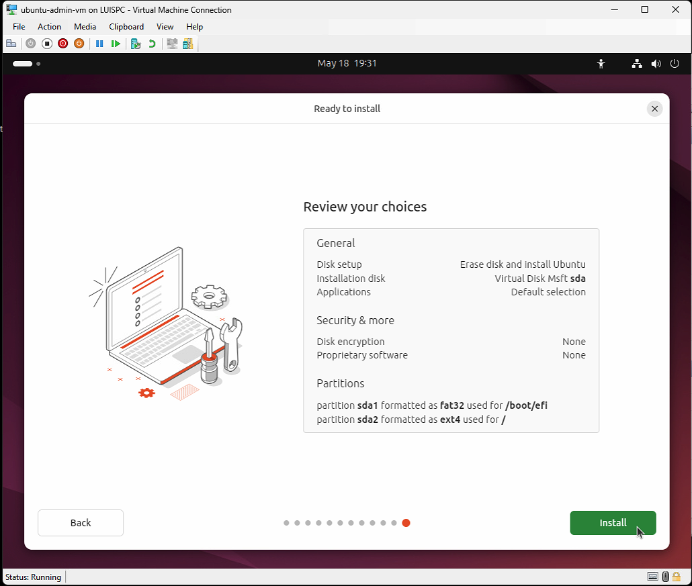

---

### 4.12: Installation Complete

Once Ubuntu has finished installing, you'll see a confirmation message:

> **Ubuntu 24.04.2 LTS is installed and ready to use**  
> Restart to complete the installation or continue testing.  
> Any changes you make will not be saved.

Click **Restart now** to finish the setup and boot into your new Ubuntu Admin VM.

> If prompted to remove the installation medium, you can ignore it. Hyper-V handles that automatically.

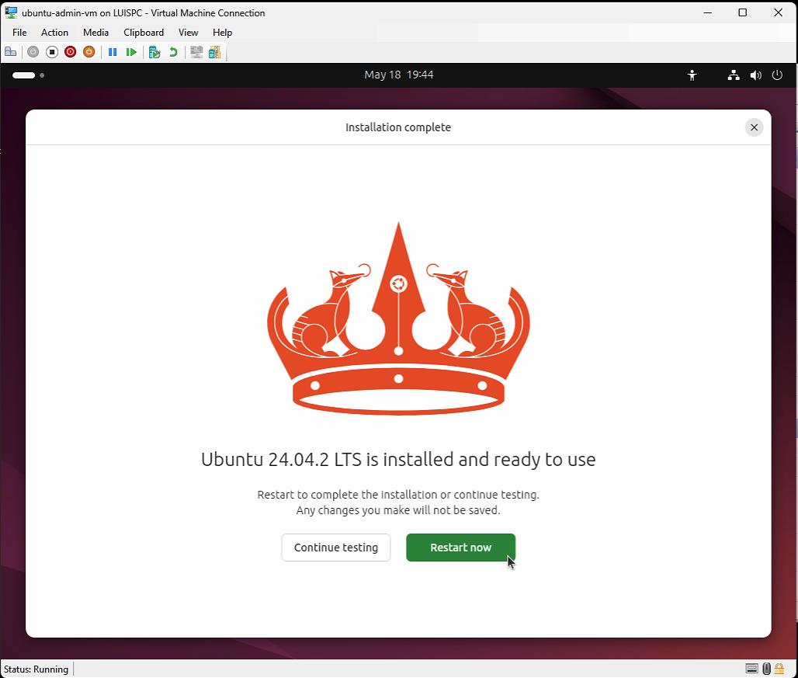

---

#### ⚠️ Final Reboot Issue: ISO Still Attached

If, after clicking **Restart Now**, your VM shows a black screen with a **red open lock icon** and doesn’t boot into Ubuntu:

This usually means the VM is still trying to boot from the Ubuntu ISO installer, which is no longer needed after installation.

#### How to Fix It:

1. Shut down the VM from the Hyper-V toolbar.
2. In **Hyper-V Manager**, right-click `ubuntu-admin-vm` → **Settings**
3. Under **SCSI Controller**, select **DVD Drive**
4. Set the media to **None** or remove the Ubuntu ISO.
5. Click **OK** and start the VM again.

The VM should now boot into your installed Ubuntu system. You’ll see the login screen, followed by the welcome screen.

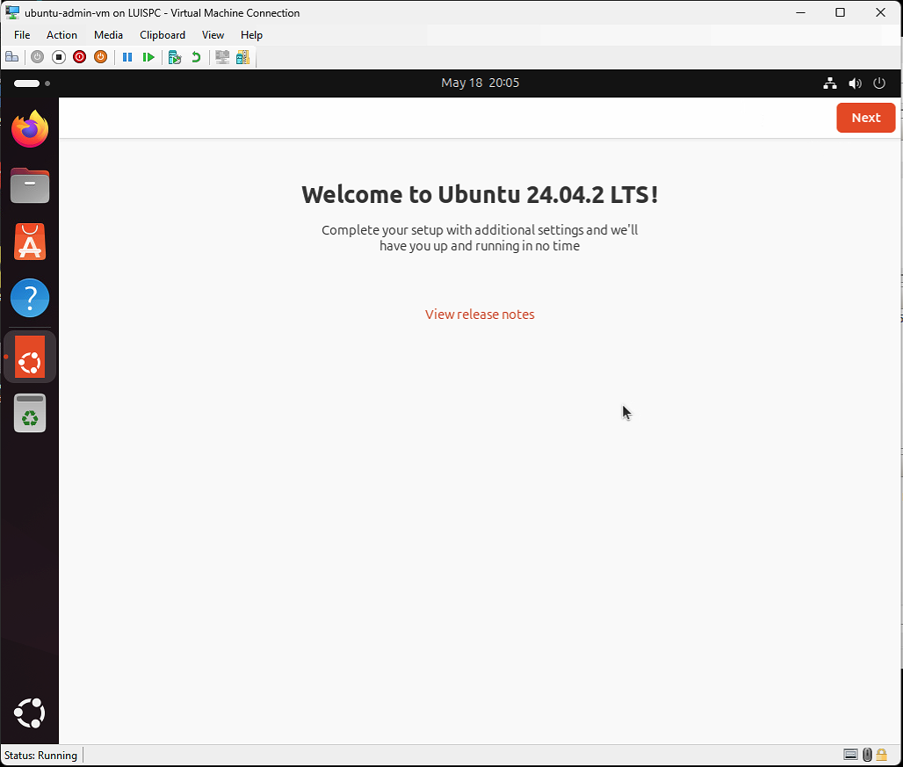

---

## Step 5: Post-Install Setup on Ubuntu Admin VM

After logging into the freshly installed Ubuntu Admin VM, we prepare the system for virtualization by applying updates and setting up required packages.

---

### 5.1: Update and Upgrade the System

To ensure the VM is secure and stable, we update all system packages before installing any virtualization tools.

---

#### Script: `scripts/update-system.sh`

This script updates the package index and upgrades the system using the Advanced Package Tool (apt) package manager.

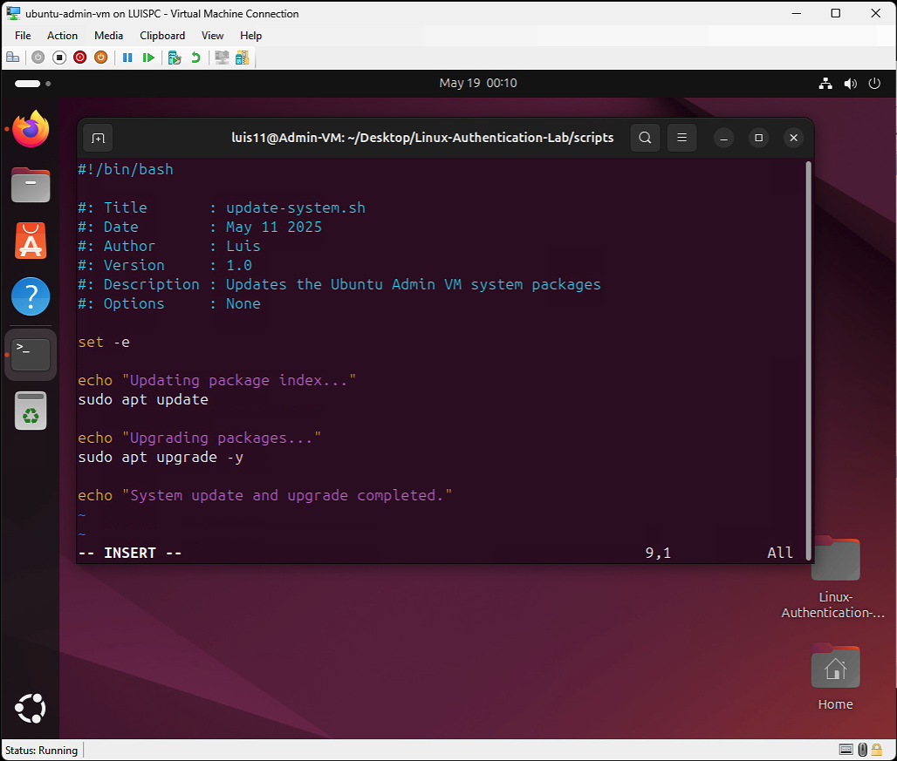

---

#### Usage
```bash
chmod +x scripts/update-system.sh
./scripts/update-system.sh
```

- If the script runs successfully, you should see output similar to the screenshot below.

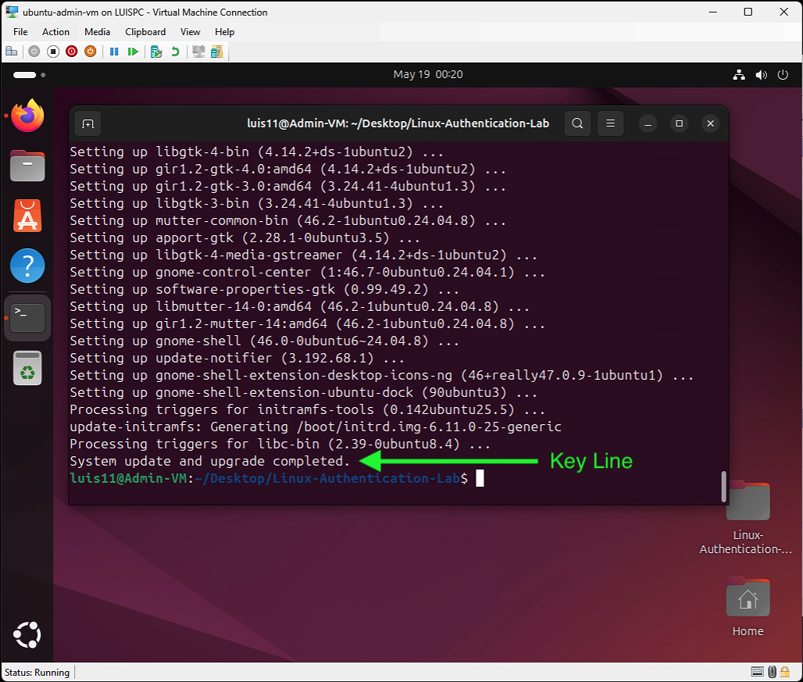

> After the upgrade, Ubuntu may prompt for system restart. If this happens, click **Restart Later**

---

### 5.2: Install KVM and Virtualization Tools

Now that the system is up to date, we install the necessary virtualization components that allow this Ubuntu Admin VM to host nested virtual machines using KVM.

---

##### Script: `scripts/install-kvm-tools.sh`

This script installs all required virtualization tools in a single run, and adds the current user to the `kvm` and `libvirt` groups, to ensure proper permission handling when using `virt-manager`.

It includes the following packages:

- `qemu-kvm`: The main hypervisor for virtualization
- `libvirt-daemon-system`: System-level libvirt services
- `libvirt-clients`: CLI tools for managing libvirt
- `virt-manager`: A GUI to create and manage virtual machines
- `bridge-utils`: Optional networking bridge tools for VM interface bridging

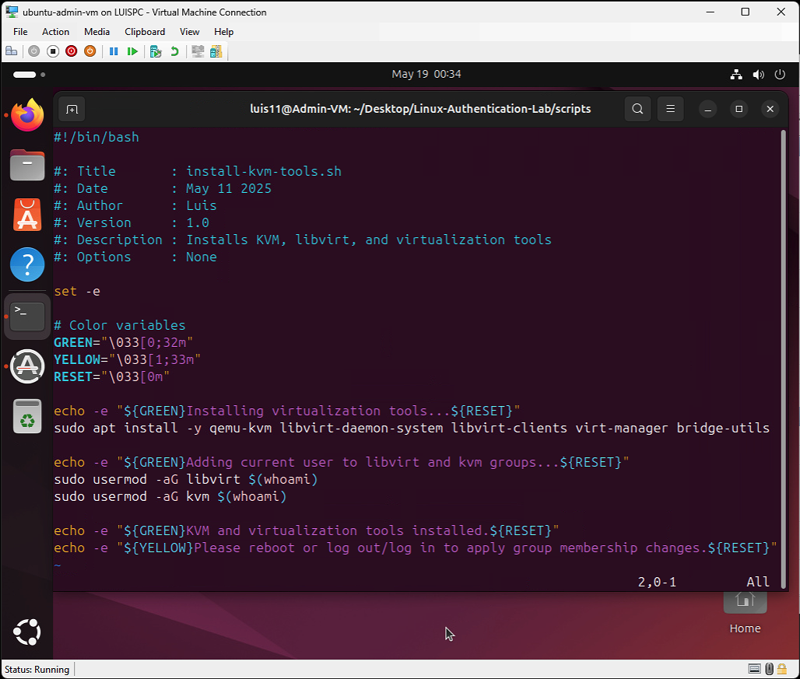

---

#### Usage
```bash
chmod +x scripts/install-kvm-tools.sh
./scripts/install-kvm-tools.sh
```

- If the script runs successfully, you should see output similar to the screenshot below.

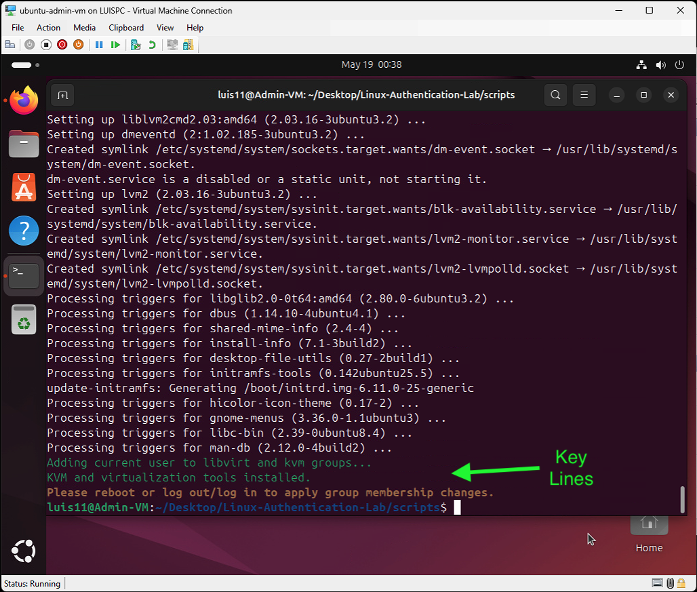

#### Restart Required

After installing the KVM tools, you must reboot the system to apply updates and to apply group membership changes. If you skip the reboot, `virt-manager` may not detect virtualization features correctly.

---

### 5.3: Verify KVM and Nested Virtualization

Before creating nested virtual machines, we verify that the virtualization stack is working correctly inside the Ubuntu Admin VM.

---

#### Commands to Run

Open a terminal and run the following commands:

```bash
lsmod | grep kvm
egrep -c '(vmx|svm)' /proc/cpuinfo
groups
virsh list --all
virt-manager
```

These commands confirm that:
- KVM modules are loaded and active
- Nested virtualization is recognized by the kernel
- The current user has access to `kvm` and `libvirt` groups
- `libvirt` is active and ready to manage VMs
- `virt-manager` can connect to the system backend (QEMU/KVM)

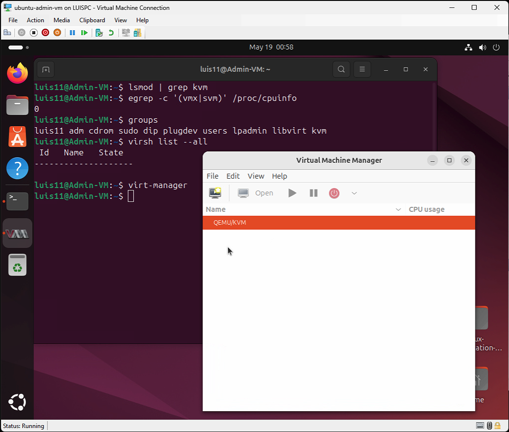

> Please ensure that `virt-manager` launches without errors and shows a local QEMU/KVM connection in the GUI. This confirms that virtualization is fully functional inside your admin VM.

> If you receive no output from `lsmod | grep kvm` or if `/proc/cpuinfo` returns `0`,  that may be expected in some Hyper-V environments. As long as `virt-manager` launches, and you can access the QEMU/KVM backend, you are good to proceed.

---

## ✅ Ubuntu Admin VM Setup Complete

The Ubuntu Admin VM is now fully configured and ready to host nested virtual machines using KVM.

We have:
- Installed and configured Ubuntu Desktop on Hyper-V
- Applied system updates and installed KVM/libvirt tools
- Verified that virtualization is functioning correctly

**Next:** Proceed to [`02-create-nested-vms.md`](./02-create-nested-vms.md) to create the Fedora IPA Server, Ubuntu Client, and Windows Client VMs inside this admin environment.