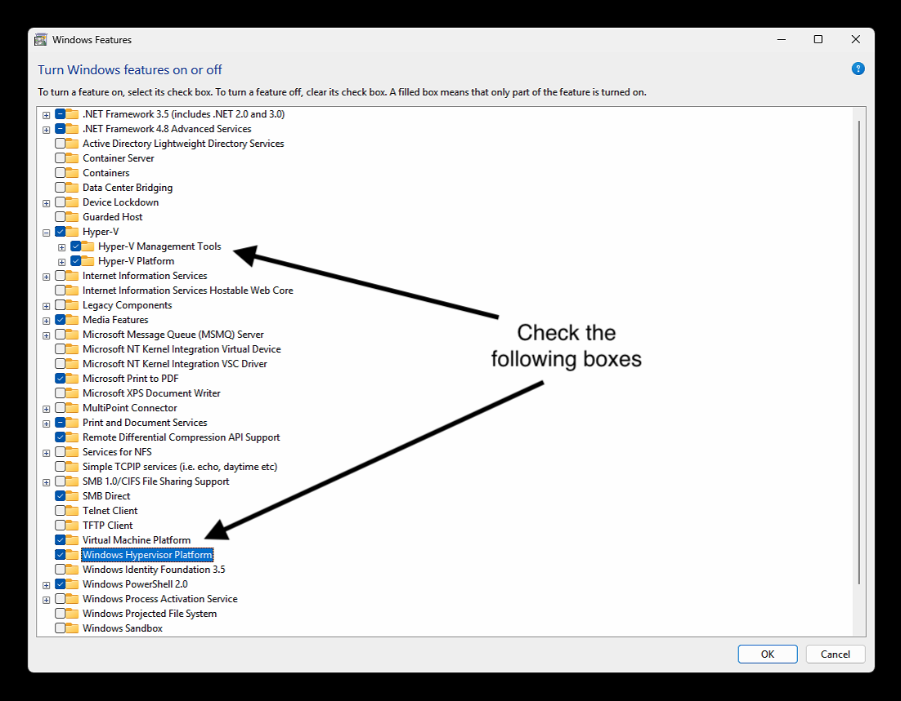
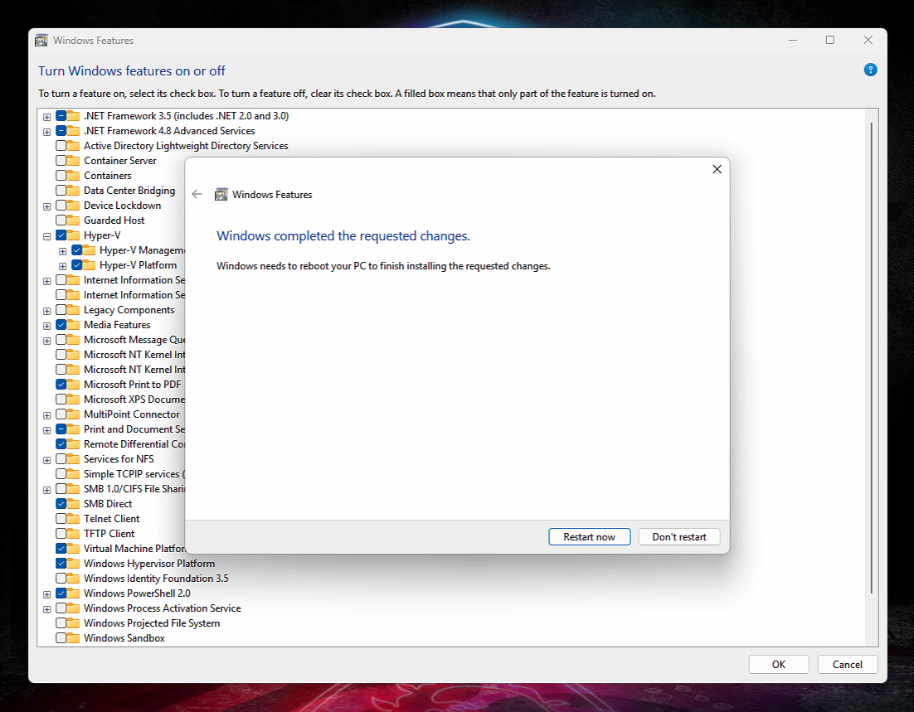
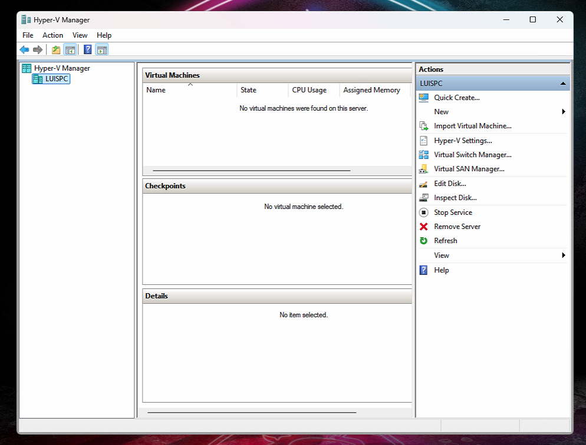
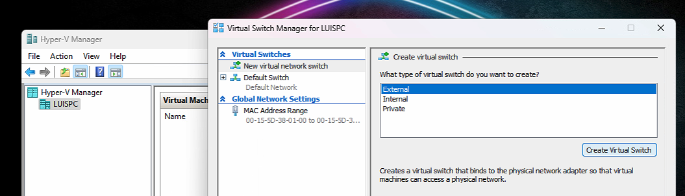
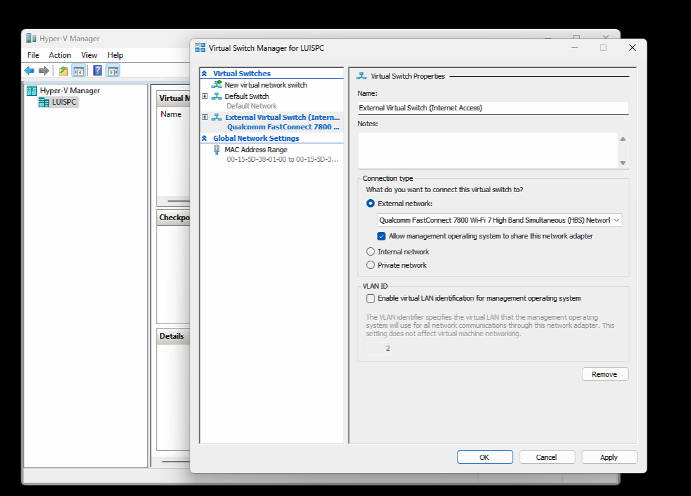

# Phase 1: Prepare Windows 11 Host for Hyper-V
_Note: This file replaces the original VirtualBox setup. See `00a-migration-rationale.md` for migration details._

## Step 1: Turn ON Hyper-V and Required Features

To run the Ubuntu Admin VM using Hyper-V, we first enable the Hyper-V feature on the Windows 11 host.

### 1. Open "Windows Features"

- Press `Windows + S` and search for “Windows Features”.
- Click **“Turn Windows features on or off”**.
- Check the following boxes:
  - **Hyper-V**
  - **Virtual Machine Platform**
  - **Windows Hypervisor Platform**
 

---

### 2. Reboot After Enabling Features

Once selected, click **OK**. Windows will apply the changes and ask you to reboot.

After rebooting, Hyper-V will be available via the Start Menu → "Hyper-V Manager".

---

# Phase 2: Set Up the Ubuntu Admin VM

## Step 1: Open Hyper-V Manager

- Press `Windows + S` and search for "Hyper-V Manager".
- Open the application and verify it launches successfully.
- Confirm your PC name appears on the left panel under Hyper-V Manager.

## Step 2 (Before VM Creation): Create an External Virtual Switch

To give the Ubuntu Admin VM full internet access and LAN communication, we have to create an **External Virtual Switch** in Hyper-V.

### 1. Open the Virtual Switch Manager

- In **Hyper-V Manager**, select your computer name (left panel)
- Click **“Virtual Switch Manager…”** from the right panel
- Select **External** and click **Create Virtual Switch**
 

---

### 2. Configure the Switch

- Name it: `External Switch (Internet Access)`
- For **Connection type**, choose the real adapter that gives your host internet access.  
  
  - In my case: `Qualcomm FastConnect 7800 Wi-Fi 7 High Band Simultaneous (HBS) Network Adapter`

- Do **not** select:
  - VirtualBox adapters
  - Numbered duplicates (#2, #3, etc.)
- Leave **Allow management OS to share this network adapter** checked (recommended)

Click **OK** to apply and close the window.

