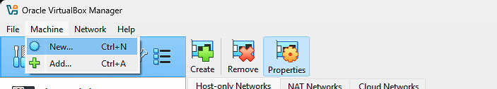
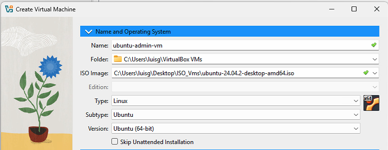
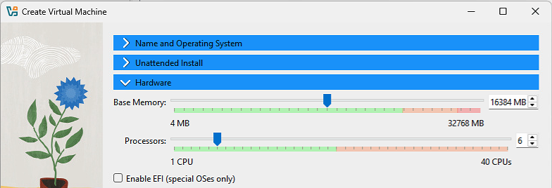
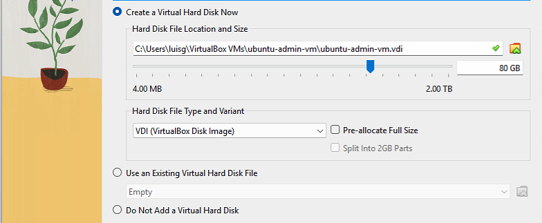
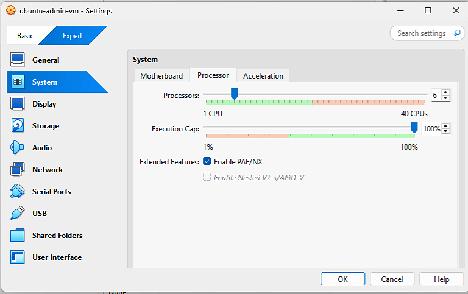
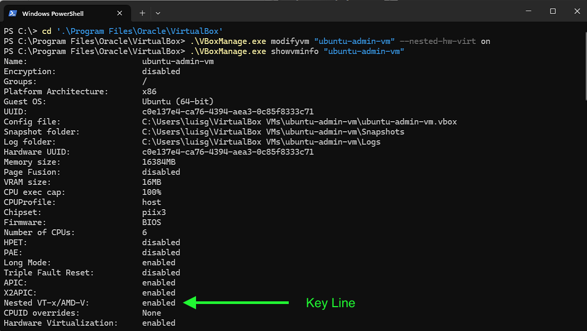
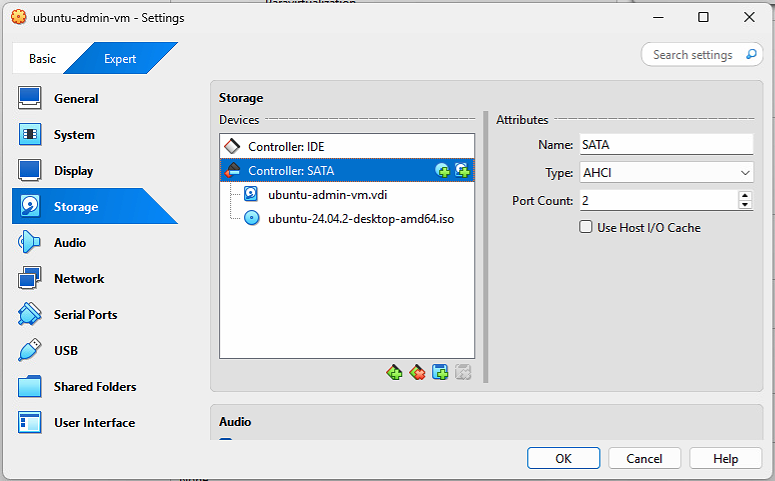
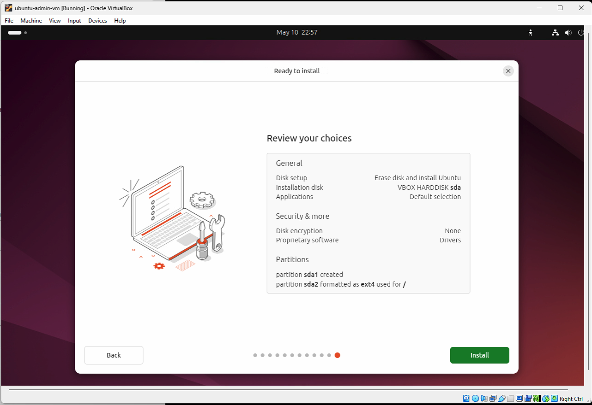
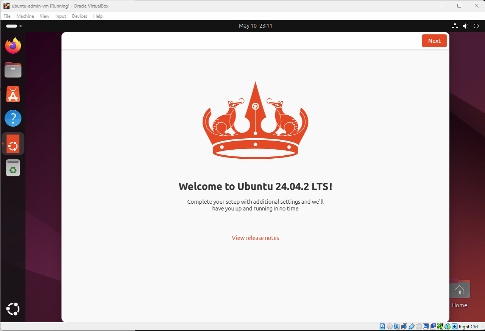

# Phase 1: Ubuntu Admin VM Setup

## Step 1: Download Ubuntu Desktop ISO

Download the latest **LTS Ubuntu Desktop** ISO from the official Ubuntu website:

- URL: [https://ubuntu.com/download/desktop](https://ubuntu.com/download/desktop) 
- Version used in this lab: Ubuntu 24.04.2 LTS
- File: `ubuntu-24.04.2-desktop-amd64.iso`
- Size: ~5.9GB

**Note**: This ISO is large (~5GB) and includes GNOME and all major desktop components. You may choose the Minimal ISO instead if you prefer a lighter base and are comfortable installing required packages manually.

---

## Step 2: Create the `ubuntu-admin-vm` in VirtualBox

### 1. Launch Virtual Box and Click "New"



### 2. Set the VM Name and OS Type

- **Name:** `ubuntu-admin-vm`
- **Type:** Linux
- **Version:** Ubuntu (64-bit)



### 3. Allocate Memory and CPU

- **RAM:** 16,384MB (16GB)
- **CPUs:** 4-6 (depending on your host capacity)



### 4. Create Virtual Hard Disk

- **Disk Type:** VDI (dynamically allocated)
- **Size:** 80GB



### 5. Configure System Settings

Go to **Settings > System > Processor**:
- **Enable Nested Virtualization** by checking:
    - "Enable PAE/NX"
    - "Enable Nested VT-x/AMD-V"

(If it's not available here, you'll enable it via `VBoxManage` after creation.)



 #### Troubleshooting VT-x/AMD-V Not Visible

 Checkbox for VT-x/AMD-V is not clickable in VirtualBox GUI. Enabled nested virtualization from the Windows host using this command (with the VM powered off):

 ```powershell
cd "C:\Program Files\Oracle\VirtualBox"
.\VBoxManage.exe modifyvm "ubuntu-admin-vm" --nested-hw-virt on
.\VBoxManage.exe showvminfo "ubuntu-admin-vm"
```


### 6. Attach the ISO

If you enabled Unattended Installation during VM creation, the ISO may already be attached and the installer will start automatically. In that case, you can skip this step.

Otherwise, attach the ISO manually:

- Go to **Settings > Storage**:
    - Under **Controller: SATA**, click the small **CD icon with the plus sign** to add a new optical drive
    - In the pop-up window, click the **Add** icon (top-left corner) to browse your local files
    - Locate and select your ISO file: `ubuntu-24.04.2-desktop-amd64.iso`
    - Click **Choose** to confirm
    - Make sure your final setup looks like the screenshot below before continuing.



### 7. Start the VM and Install Ubuntu

Select `ubuntu-admin-vm` in VirtualBox and click **Start**. The VM will boot into the Ubuntu installer.

Go through the installation using default options:

- Choose your preferred keyboard layout
- Accept default installation type (erase disk and install Ubuntu)
- Optionally install updates and third-party software
- Create a user account with **sudo access**



After the installation completes, reboot the VM. Then, the system will prompt:

> Please remove the installation medium, then press ENTER

If you already removed the ISO, simply press **Enter** to reboot into your installed system.

When the desktop loads for the first time, you should see Ubuntu welcome screen like this:

