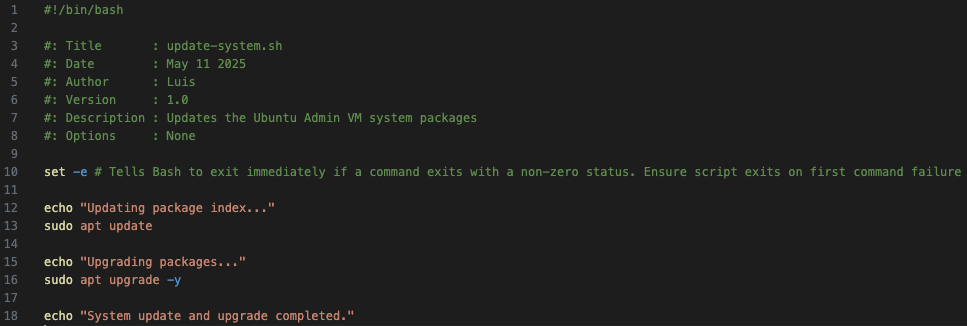
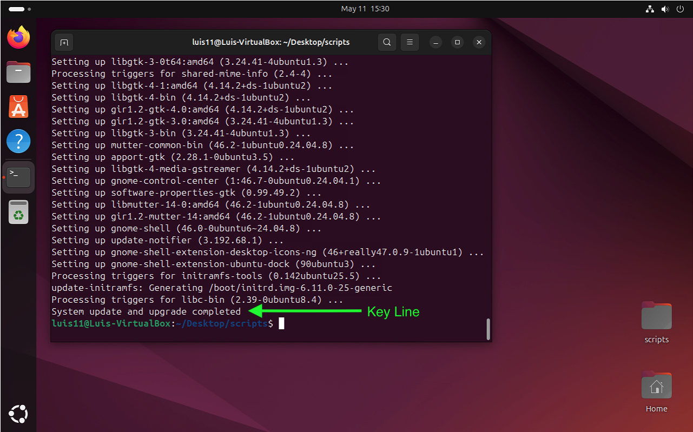
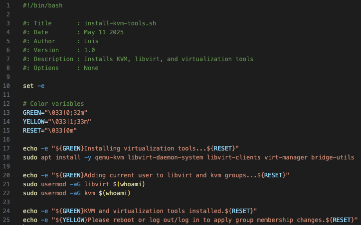
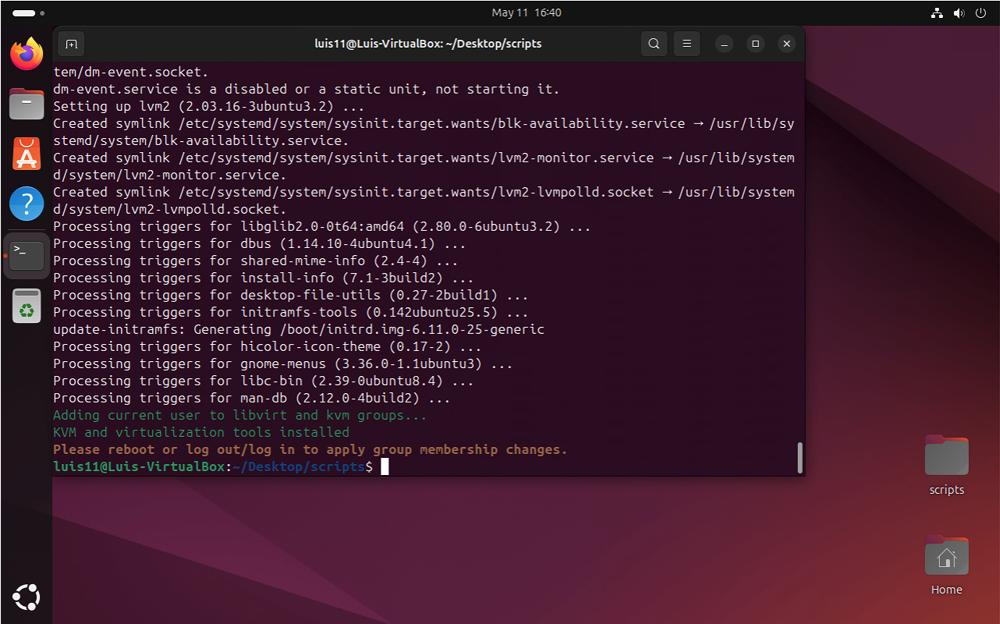
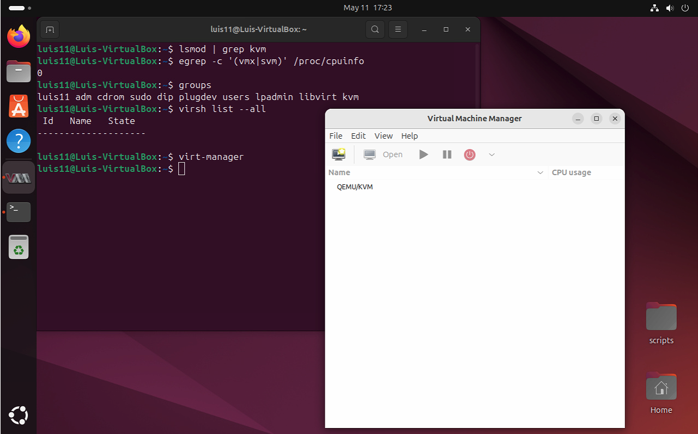

# Phase 2: Create Nested VMs using KVM

In this phase, we will configure the Ubuntu Admin VM (`ubuntu-admin-vm`) to run nested virtual machines using KVM and libvirt. These nested VM's will be used to simulate a real authentication lab, including FreeIPA server and Linux clients.

We will being by updating the sytem, then install KVM and all necessary virtualization tools, and finally configure everything to prepare for the creation of the nested guest machines.

---

## Step 1: Update and Upgrade the System

Before installing any virtualization tools, we update and upgrade the Ubuntu Admin VM to ensure all system packages are current. This improves stability and avoids dependency issues when installing KVM components.

### Script: `scripts/update-system.sh`

- This script automates the process of updating the system’s package index and upgrading all available packages. It also adds structured output for better terminal readability.



#### Usage
```bash
chmod +x scripts/update-system.sh
./scripts/update-system.sh
```
- If the script runs sucessfully, you should see output similar to the screenshot below.



### Restart Required

After the upgrade, Ubuntu may prompt for system restart. If this happens, click **Restart Now** to apply updates.

---

## Step 2: Install KVM and Virtualization Tools

We begin by installing the core virtualization packages inside the Ubuntu Admin VM. These tools enable you to create and manage KVM-based virtual machines using the `virt-manager` interface and `libvirt`.

### Tools to Install

- `qemu-kvm`: Core KVM package
- `libvirt-daemon-system`: System-level libvirt services
- `libvirt-clients`: CLI tools for managing libvirt
- `virt-manager`: GUI ti create/manage VMs
- `bridge-utils`: Optional networking bridge tools

### Script: `scripts/install-kvm-tools.sh`

This script installs all required virtualization tools in a single run, and adds the current user to the kvm and libvirt groups, to ensure proper permission handling when using `virt-manager`.



#### Usage
```bash
chmod +x scripts/install-kvm-tools.sh
./scripts/install-kvm-tools.sh
```

- If the script runs sucessfully, you should see output similar to the screenshot below.



### Restart Required Once Again

After installing the KVM tools, you must reboot the system or log out/log in in to apply group membership changes. If this step is skipped, `virt-manager` may fail to access virtualization features.

---

## Step 3: Verify KVM and Nested Virtualization

Before proceeding with VM creation, we verify that the virtualization stack is working correctly inside the Ubuntu Admin VM.

### Commands to Run

Please run the following commands in order:

```bash
lsmod | grep kvm
egrep -c '(vmx|svm)' /proc/cpuinfo
groups
virsh list --all
virt-manager
```

These commands confirm that:
- KVM modules are loaded
- Nested virtualization is available
- The user has proper group access
- libvirt is active and ready
- virt-manager can connect to the system

Please ensure that `virt-manager` launches without errors and shows a local QEMU/KVM connection in the GUI. This confirms that virtualization is fully functional inside your admin VM.

If you receive no output from `lsmod | grep kvm` or if `/proc/cpuinfo` returns `0` for `vmx` or `svm`, this is expected behavior in some VirtualBox-based nested environments. As long as `virt-manager` launches, and you can access the QEMU/KVM backend, you are good to proceed.

See the screenshot below for a reference of the expected output and GUI status:

