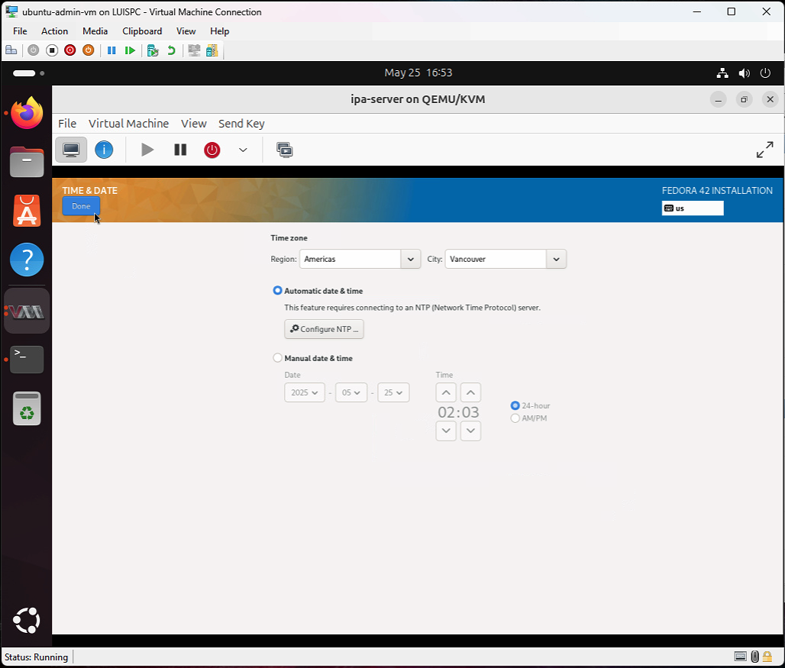
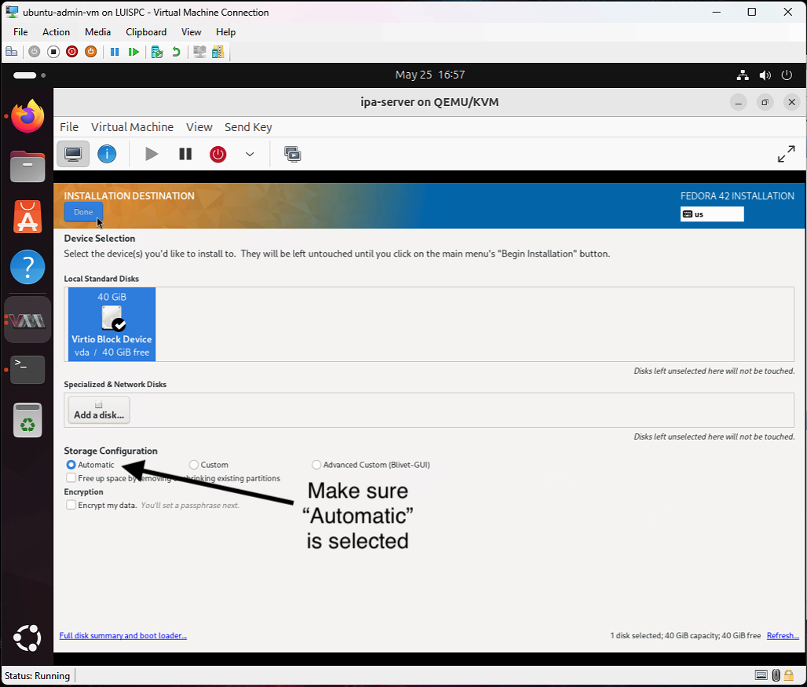
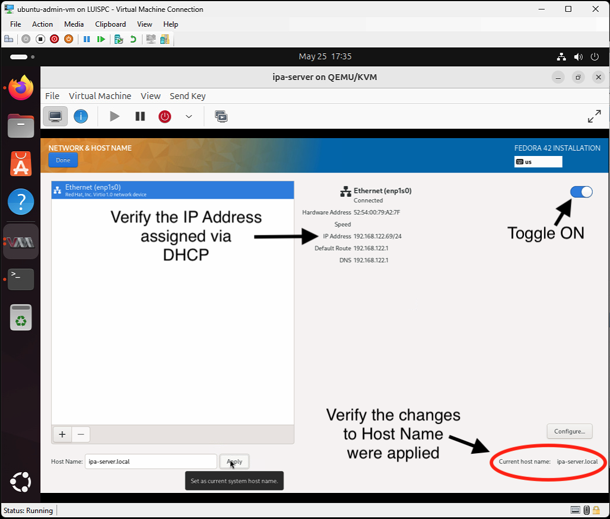
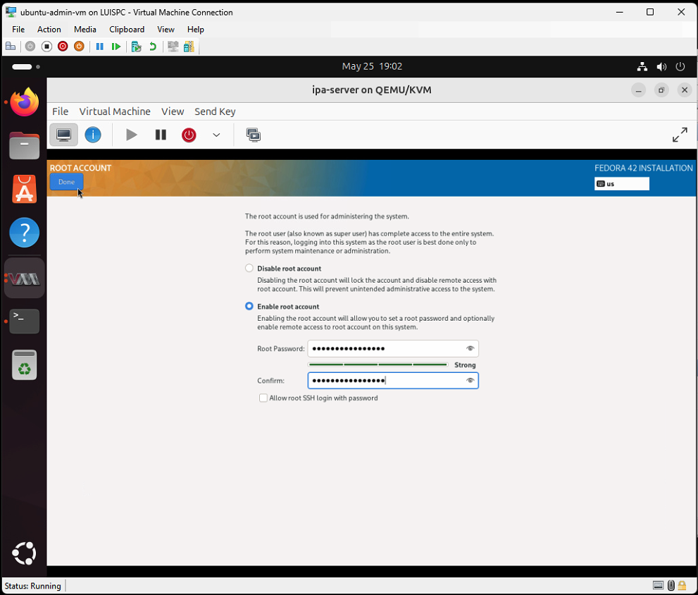
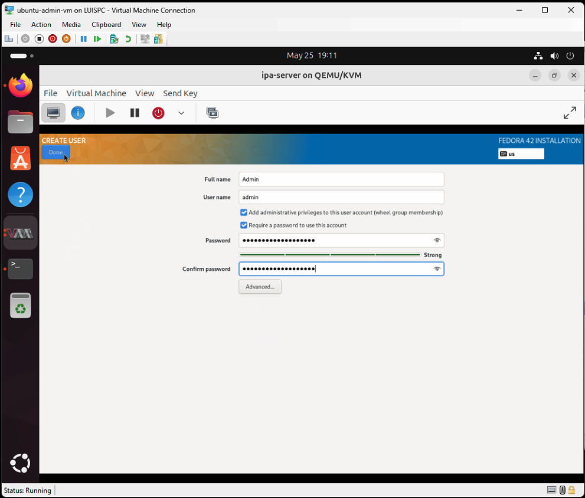
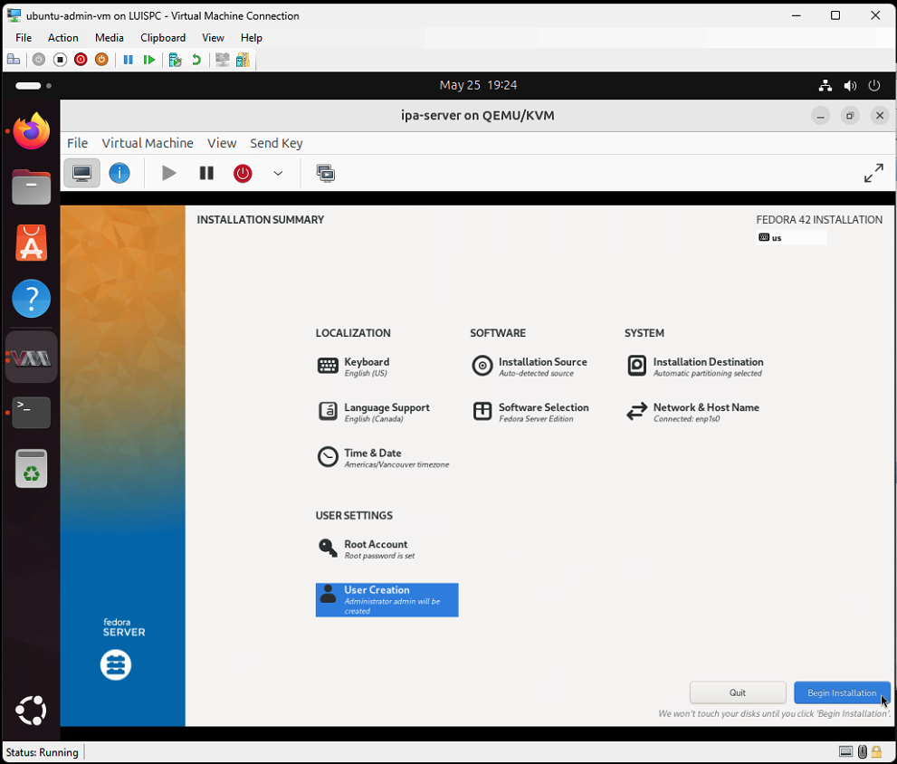
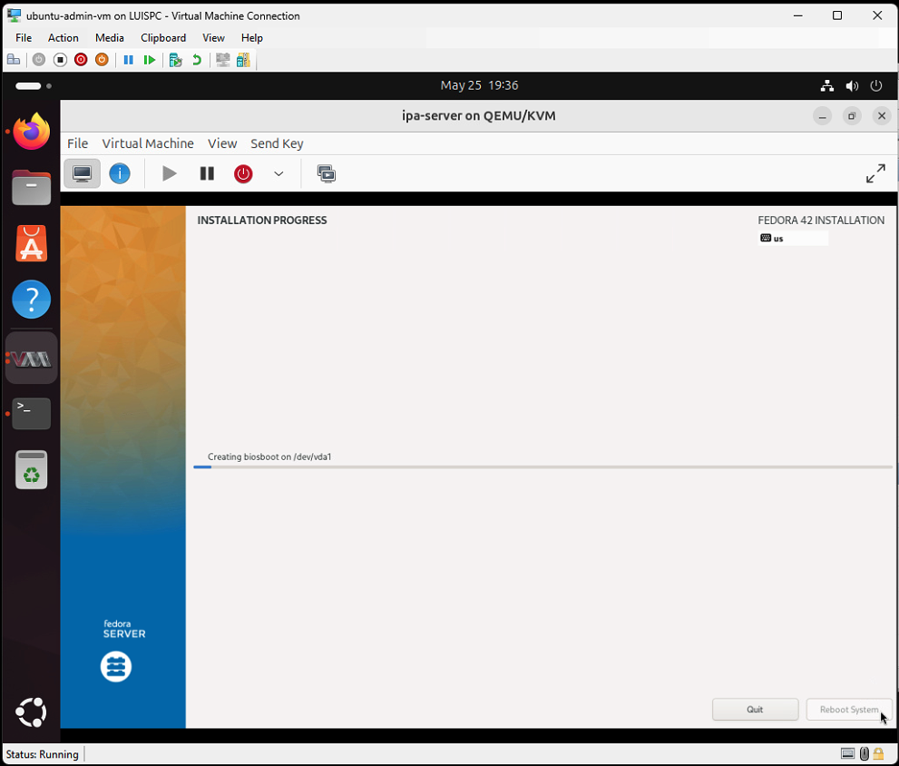
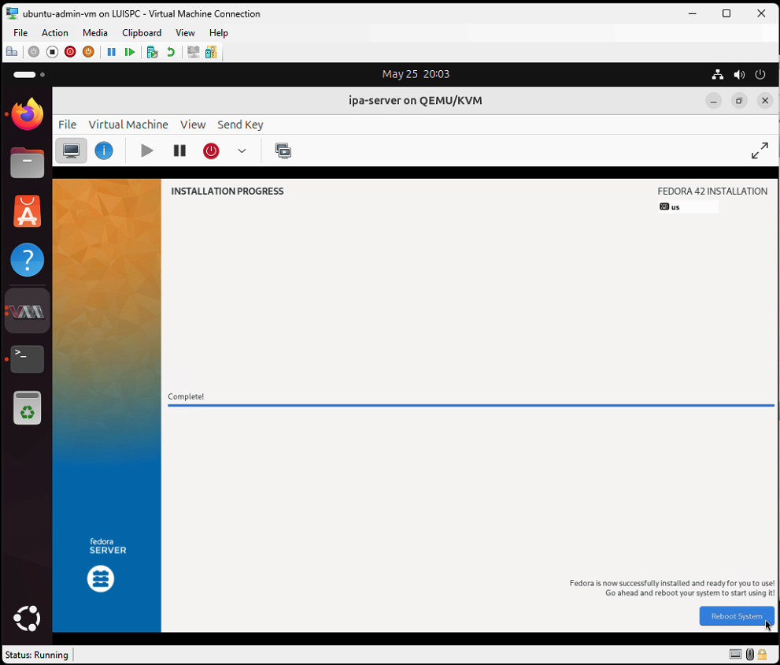
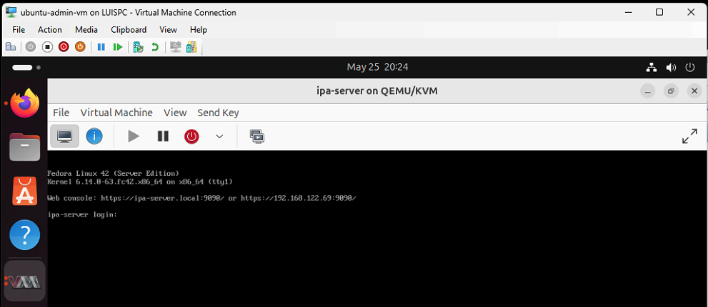

# Phase 3: Create Nested VMs using KVM

Now that our Ubuntu Admin VM is fully configured with KVM and libvirt, we can begin creating the nested virtual machines that will form our authentication lab.

These nested VMs will include:

- `ipa-server`: A Fedora Server running FreeIPA with DNS and Kerberos
- `ubuntu-client1`: A Linux workstation joined to the IPA domain
- `ubuntu-client2`: (Optional) A second Linux client for multi-client testing
- `win-client`: (Optional) A Windows 10/11 domain client

---

## Step 1: Create the ipa-server VM

This virtual machine will host the FreeIPA server, which provides centralized authentication, DNS, and Kerberos services for our lab.

---

### 1.1: Download Fedora Server 42 ISO

Download the official Fedora Server ISO from the Fedora Project:

- Download the latest [Fedora Server ISO](https://fedoraproject.org/en/server/download)
- Version used in this lab: **Fedora Server 42 (x86_64)**
- File: `Fedora-Server-dvd-x86_64-42-1.1.iso`
- Size: ~2.7GB


> Tip: Use the Ubuntu Admin VM's browser to download the ISO directly into `~/Downloads` or a custom `~/ISOs` directory

---

### 1.2: Create the ipa-server VM in Virt-Manager

We'll now create the virtual machine for the FreeIPA server using the `virt-manager` GUI inside the Ubuntu Admin VM.

---

#### 1. Launch Virt-Manager

- Open a terminal and run:
  ```bash
  virt-manager
  ```

- The Virtual Machine Manager window should open and display a **QEMU/KVM** connection.

#### 2. Start the New VM Wizard

- In **virt-manager**, click the **Monitor + ▶️ icon** in the top-left corner to begin creating a new VM.
- Select **“Local install media (ISO)”**
- Click **Forward**

> ⚠️ **Note:** If you see a red warning saying “KVM is not available,” this is expected behavior under nested virtualization on Hyper-V.  
> The VM will still boot and run normally using QEMU software emulation. Performance may be slower, but it will work correctly for lab purposes.


---

#### 3. Choose Installation ISO

- Click **Browse...** to select the ISO file.
- In the *Locate ISO media volume* window, click **Browse Local**.
- Navigate to the folder where you saved the Fedora Server ISO.
- Select: `Fedora-Server-dvd-x86_64-42-1.1.iso`
- Click **Open**, then **Forward**

> Tip: If you don't see the ISO listed, make sure you're browsing the correct location (like `~/Downloads` or `~/Desktop/ISOs`).

> You can also drag and drop the ISO into the selection window to register it.


---

#### 4. Assign Memory and CPU

- **Memory**: Set to `4096 MB` (4 GB)
- **CPUs**: Set to `2` vCPUs

> You can increase these values later if FreeIPA feels slow, but 4 GB and 2 vCPUs is a solid starting point.


---

#### 5. Create Virtual Disk

- Leave **Enable storage for this virtual machine** checked
- Select **Create a disk image for the virtual machine**
- Set the **size** to: `40.0 GB`
- Leave the default location

> Fedora recommends at least 40 GB of storage. That storage size is enough space for FreeIPA logs, updates, and snapshots.

> The image will be created in **QCOW2 format** by default.


---

#### 6. Final VM Configuration

- Set the **Name** to `ipa-server` (reflects its role as FreeIPA server)
- Confirm the ISO path, memory, CPUs, and disk size
- Ensure **Network selection** is set to `Virtual Network 'default': NAT`
- Check the box **Customize configuration before install**
- Click **Finish** to open the final configuration screen

This lets us adjust system settings before launching the Fedora installer.


---

#### 7. Review & Customize VM Configuration

Before Fedora begins installing, we review and adjust the new VM’s configuration.

---

**Overview Tab**
- Confirm the VM name, architecture, chipset (`Q35`), and firmware (`BIOS`) are correct.
- No changes needed here.


---

**Boot Options**
- Go to the **Boot Options** tab
- Check **Enable boot menu**
- Make sure **CDROM** is first in the boot device list (before Hard Disk)

This ensures the Fedora ISO boots properly.


---

Once ready, click **Begin Installation** to launch the Fedora Server installer.


---

### 1.3: Install Fedora Server OS

After launching the `ipa-server` VM and booting from the ISO, you should see the Fedora GRUB menu. This confirms that the ISO loaded correctly and the VM is ready to begin installation.

---

#### 1. Fedora GRUB Boot Menu

- At the GRUB screen, press **Enter** to select:
  - `Install Fedora 42`

This will launch the graphical installer.

> Tip: You may also choose **"Test this media & install Fedora 42"** for an optional integrity check. However, if you trust your ISO source, it's safe to skip the test and proceed directly.


---

#### 2. Graphical Installer Loads

After a brief loading period, you should see the **Welcome to Fedora** graphical installer screen.


---

### 1.4: Select Language and Installation Destination

Now that the Fedora installer has launched, we’ll configure the installation language and the target disk.

---

#### 1. Select Language

- Choose your preferred language from the list.
  - In this lab, we selected: `English (Canada)`
- Click **Continue**

> This sets the language for the installation process and the default system locale.

---

#### 2. Installation Summary Screen

We’ll now see the **Installation Summary** window. From here, we configure critical options like:

- **Time & Date**
- **Installation Destination**
- **Software Selection**
- **Networking**
- **User Settings**

Each of these sections must be reviewed before installation can proceed.

Your screen should now look like this:


In the next step, we’ll begin customizing these one by one.

---

### 1.5: Configure Time & Date

To ensure proper time synchronization across the domain and accurate Kerberos authentication, we must configure the correct timezone for the IPA server.

---

#### 1. Open Time & Date Settings

- In the **Installation Summary** screen, click **Time & Date**

---

#### 2. Select Your Region and Timezone

- Region: `Americas`
- City: `Vancouver`

Fedora should automatically detect your system time and location, but verify it's correct. This ensures log timestamps, certificates, and time-sensitive protocols (like Kerberos) work reliably.

> **Tip:** Leave the default **Automatic Date & Time** enabled unless you are on an isolated network.

> Fedora enables Automatic Date & Time by default using **systemd-timesyncd** (or chrony) and will automatically sync with public NTP servers as long as the VM has internet access.

---

#### 3. Click **Done**

After confirming your timezone, click **Done** (top-left corner) to return to the Installation Summary screen.



---

### 1.6: Set Installation Destination (Disk)

Next, we configure the target disk where Fedora will be installed.

---

#### 1. Open Installation Destination

- From the **Installation Summary** screen, click **Installation Destination**
- We should see the virtual hard disk listed under **Local Standard Disks**  
  Example: `Virtio Block Device - 40 GiB`

---

#### 2. Select the Disk

- Click the checkbox to select the disk (it should highlight with a checkmark)

---

#### 3. Storage Configuration

- Under **Storage Configuration**, leave the default **“Automatic”** selected. 
  This allows Fedora to automatically partition the disk (LVM layout)



> This is ideal for FreeIPA since it ensures Fedora’s default partition layout, including separate logical volumes, is applied.

---

#### 4. Confirm

- Click **Done** to return to the Installation Summary

Fedora will reserve the disk for installation, but no data is written until **Begin Installation** is clicked later.

---

### 1.7: Configure Network and Hostname

Before installation, we need to ensure the Fedora VM is connected to the network and assigned a hostname that reflects its server role.

---

#### 1. Enable Networking and Set Hostname

- Click **Network & Host Name** from the Installation Summary screen.
- On the right panel, toggle the **switch to ON** (upper right) to enable the NIC (`enp1s0`).
- You should see an IP address assigned via DHCP.
- In the **Hostname** field (bottom left), enter:

```
ipa-server.local
```

- Click **Apply**, then click **Done** to return to the summary screen.



> The `.local` suffix is optional but recommended to help with DNS-based discovery in future lab steps.

---

### 1.8: Set Root Password and Create Admin User

Before installation begins, Fedora requires at least one user account to be configured. We’ll set a **secure root password** and create a primary admin user for managing the system.

---

#### 1. Set Root Password

- Click **Root Account** from the Installation Summary screen
- By default, **"Disable root account"** is selected
- Switch to **"Enable root account"**
- Enter a strong root password and confirm it.
- Click **Done**

> ⚠️ Root login is typically disabled for SSH by default. This account is mainly for system recovery and emergency admin access. 

> Leave **"Allow root SSH login with password"** unchecked for better security. Use your admin user with `sudo` instead.



---

#### 2. Create Admin User

- Click **User Creation**
- Fill in the details:
  - **Full name**: Admin
  - **Username**: admin
  - Check: **Add administrative privileges to this user account**
  - Check: **Require a password to use this account**
  - Set and confirm a secure password
- Click **Done**



> This admin user will be your main login and have `sudo` privileges for day-to-day tasks.

---

### 1.9: Begin Installation

Once all required sections in the **Installation Summary** screen are completed (no red warnings), you’re ready to begin installing Fedora Server on the `ipa-server` VM.

---

#### Final Check

Make sure the following sections are complete:

- **Time & Date**: Correct region selected (e.g., `America/Vancouver`)
- **Installation Destination**: Disk selected with **Automatic** storage configuration
- **Network & Hostname**: Network connected, hostname set (e.g., `ipa-server.local`)
- **Root Account**: Enabled with a strong password
- **User Creation**: Admin user created with `sudo` privileges

> At this point, you should no longer see any red warnings on the Installation Summary screen. See the screenshot below.

> If needed, compare your screen to [Screenshot 36](../screenshots/36-ipa-vm-install-summary.png), which shows the incomplete setup.



---

#### Begin the Installation

- Click **Begin Installation** in the lower right corner.

Fedora will now begin installing the OS onto your virtual disk.

> This step may take around **5–10 minutes**, depending on your system performance.

While the installation progresses, you’ll see a status screen with real-time logs.



Once installation is finished, you’ll be prompted to reboot the system.

We'll handle that next in **Step 1.10: Finalize and Reboot**.

---

### 1.10: Finish Installation and Reboot

Once Fedora completes the installation process, you’ll see a confirmation message at the bottom of the screen:

> **Fedora is now successfully installed and ready for you to use!**  
> Go ahead and reboot your system to start using it!

- Click **Reboot System** to finish the installation and restart the VM.



> After rebooting, Fedora will boot from the virtual disk and not the ISO. No manual ISO removal is needed in `Virt-Manager`.

> You should land on a login prompt or desktop environment depending on the Fedora Server edition installed.

---

### 1.11: Verify Fedora Boot and Login

After the reboot, your `ipa-server` VM should now boot directly from the installed virtual disk. This confirms the installation was successful and the VM is functioning correctly.

---

#### What to Expect

- You’ll see the **Fedora boot splash** followed by a **login prompt**
- If you created an admin user (e.g., `admin`), log in with that account

> If the boot screen is stuck or shows ISO-related errors, make sure the virtual disk is the first boot option in **VM → Boot Options**.

> The Fedora login prompt or initial terminal after login should like the screenshot below:



Once logged in, your Fedora Server VM is successfully installed and ready for future configuration.

---
