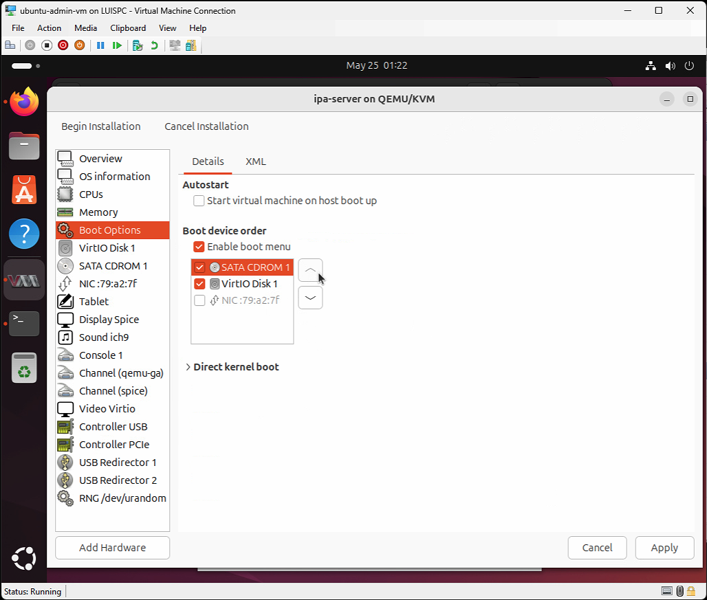

# Phase 3: Create Nested VMs using KVM

Now that our Ubuntu Admin VM is fully configured with KVM and libvirt, we can begin creating the nested virtual machines that will form our authentication lab.

These nested VMs will include:

- `ipa-server`: A Fedora Server running FreeIPA with DNS and Kerberos
- `ubuntu-client1`: A Linux workstation joined to the IPA domain
- `ubuntu-client2`: (Optional) A second Linux client for multi-client testing
- `win-client`: (Optional) A Windows 10/11 domain client

---

## Step 1: Create the ipa-server VM

This virtual machine will host the FreeIPA server, which provides centralized authentication, DNS, and Kerberos services for our lab.

---

### 1.1: Download Fedora Server 42 ISO

Download the official Fedora Server ISO from the Fedora Project:

- Download the latest [Fedora Server ISO](https://fedoraproject.org/en/server/download)
- Version used in this lab: **Fedora Server 42 (x86_64)**
- File: `Fedora-Server-dvd-x86_64-42-1.1.iso`
- Size: ~2.7GB


> Tip: Use the Ubuntu Admin VM's browser to download the ISO directly into `~/Downloads` or a custom `~/ISOs` directory

---

### 1.2: Create the ipa-server VM in Virt-Manager

We'll now create the virtual machine for the FreeIPA server using the `virt-manager` GUI inside the Ubuntu Admin VM.

---

#### 1. Launch Virt-Manager

- Open a terminal and run:
  ```bash
  virt-manager
  ```

- The Virtual Machine Manager window should open and display a **QEMU/KVM** connection.

#### 2. Start the New VM Wizard

- In **virt-manager**, click the **Monitor + ▶️ icon** in the top-left corner to begin creating a new VM.
- Select **“Local install media (ISO)”**
- Click **Forward**

> ⚠️ **Note:** If you see a red warning saying “KVM is not available,” this is expected behavior under nested virtualization on Hyper-V.  
> The VM will still boot and run normally using QEMU software emulation. Performance may be slower, but it will work correctly for lab purposes.


---

#### 3. Choose Installation ISO

- Click **Browse...** to select the ISO file.
- In the *Locate ISO media volume* window, click **Browse Local**.
- Navigate to the folder where you saved the Fedora Server ISO.
- Select: `Fedora-Server-dvd-x86_64-42-1.1.iso`
- Click **Open**, then **Forward**

> Tip: If you don't see the ISO listed, make sure you're browsing the correct location (like `~/Downloads` or `~/Desktop/ISOs`).  
> You can also drag and drop the ISO into the selection window to register it.


---

#### 4. Assign Memory and CPU

- **Memory**: Set to `4096 MB` (4 GB)
- **CPUs**: Set to `2` vCPUs

> You can increase these values later if FreeIPA feels slow, but 4 GB and 2 vCPUs is a solid starting point.


---

#### 5. Create Virtual Disk

- Leave **Enable storage for this virtual machine** checked
- Select **Create a disk image for the virtual machine**
- Set the **size** to: `40.0 GB`
- Leave the default location

> Fedora recommends at least 40 GB of storage. That storage size is enough space for FreeIPA logs, updates, and snapshots.
> The image will be created in **QCOW2 format** by default.


---

#### 6. Final VM Configuration

- Set the **Name** to `ipa-server` (reflects its role as FreeIPA server)
- Confirm the ISO path, memory, CPUs, and disk size
- Ensure **Network selection** is set to `Virtual Network 'default': NAT`
- Check the box **Customize configuration before install**
- Click **Finish** to open the final configuration screen

This lets us adjust system settings before launching the Fedora installer.


---

#### 7. Review & Customize VM Configuration

Before Fedora begins installing, we review and fine-tune the new VM’s configuration.

---

**Overview Tab**
- Confirm the VM name, architecture, chipset (`Q35`), and firmware (`BIOS`) are correct.
- No changes needed here.


---

**Boot Options**
- Go to the **Boot Options** tab
- ✅ Check **Enable boot menu**
- ✅ Make sure **CDROM** is first in the boot device list (before Hard Disk)

This ensures the Fedora ISO boots properly.



---

Once ready, click **Begin Installation** to launch the Fedora Server installer.


---

### 1.3: Install Fedora Server OS

After launching the `ipa-server` VM and booting from the ISO, you should see the Fedora GRUB menu. This confirms that the ISO loaded correctly and the VM is ready to begin installation.

---

#### 1. Fedora GRUB Boot Menu

- At the GRUB screen, press **Enter** to select:
  - `Install Fedora 42`

This will launch the graphical installer.

> Tip: You may also choose **"Test this media & install Fedora 42"** for an optional integrity check. However, if you trust your ISO source, it's safe to skip the test and proceed directly.


---

#### 2. Graphical Installer Loads

After a brief loading period, you should see the **Welcome to Fedora** graphical installer screen.


We'll continue setup in the next step by selecting installation language and target disk.

---

### 1.4: Select Language and Installation Destination

Now that the Fedora installer has launched, we’ll configure the installation language and the target disk.

---

#### 1. Select Language

- Choose your preferred language from the list.
  - In this lab, we selected: `English (Canada)`
- Click **Continue**

> This sets the language for the installation process and the default system locale.

---

#### 2. Installation Summary Screen

We’ll now see the **Installation Summary** window. From here, we configure critical options like:

- **Time & Date**
- **Installation Destination**
- **Software Selection**
- **Networking**
- **User Settings**

Each of these sections must be reviewed before installation can proceed.

Your screen should now look like this:


In the next step, we’ll begin customizing these one by one.